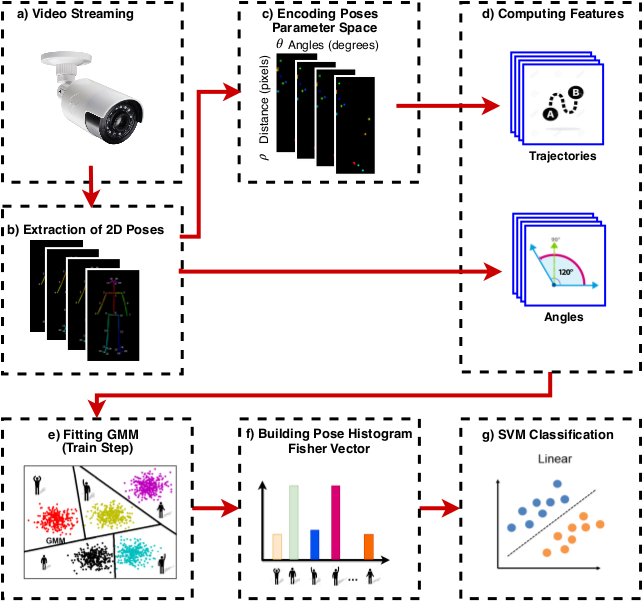

# Human Action Recognition in Videos Based on Spatiotemporal Features and Bag-of-Poses

[[Research Group Page](http://recogna.tech/)] [[Paper Link]()]

<h5>This repository presents a new method based spatiotemporal features and Bag-of-Poses to perform Human Action Recognition from videos.</h5> 

Ilustration of architeture of proposed method:


## Abstract

Currently, there is a large number of methods that use 2D poses to represent and recognize human action in videos. Most of these methods use information computed from raw 2D poses based on the straight line segments that form the body parts in a 2D pose model in order to extract features (e.g., angles and trajectories). In our work, we propose a new method of representing 2D poses. Instead of directly using the straight line segments, firstly, the 2D pose is converted to the parameter space in which each segment is mapped to a point. Then, from the parameter space, spatiotemporal features are extracted and encoded using a Bag-of-Poses approach, then used for human action recognition in the video. Experiments on two well-known public datasets, Weizmann and KTH, showed that the proposed method using 2D poses encoded in parameter space can improve the recognition rates, obtaining competitive accuracy rates compared to state-of-the-art methods.

If you find this work helpful for your research, please cite our following paper:

M. Varges and A. N. Marana. **Human Action Recognition in Videos Based on Spatiotemporal Features and Bag-of-Poses.** Applied Soft Computing, 2020.

```
@inproceedings{HARBop_asoc,
    title = {Human Action Recognition in Videos Based on Spatiotemporal Features and Bag-of-Poses},
    author = {Murilo Varges da Silva and Aparecido Nilceu Marana.},
    booktitle = {Applied Soft Computing},
    year = {2019},
    keywords={Human Action Recognition, Surveillance Systems, Spatiotemporal Features, Video Sequences, Bag-of-Poses},
}
```
If you have any question or feedback about the code, please contact: murilo.varges@gmail.com.

## Requirements

To run this project you will need to install the follows softwares:
* [OpenPose Framework](https://github.com/CMU-Perceptual-Computing-Lab/openpose) (Optional)
* Python version 3.6 or higher

This project requires the following dependencies:

```
matplotlib==2.2.2
numpy==1.15.0
pandas==0.22.0
seaborn==0.9.0
scikit_learn==0.21.3
```

Install the requirements with command:
```
pip install -r requirements.txt
```
## Tutorials
We provide some basic tutorials for you to get familar with the code and tools.
1. [2D Poses Extraction](tutorials/2DPoses_extraction.md)
2. [Features Extraction](tutorials/features_extraction.md)
3. [Human Action Recognition](tutorials/classification.md)
4. [Features Embedding Visualization](tutorials/features_visualization.md)


## License
This project is Apache 2.0 licensed, as found in the LICENSE file.

### Acknowledgements
We thank NVIDIA Corporation for the donation of the GPU used in this study. This study was financed in part by CAPES - Brazil (Finance Code 001).

